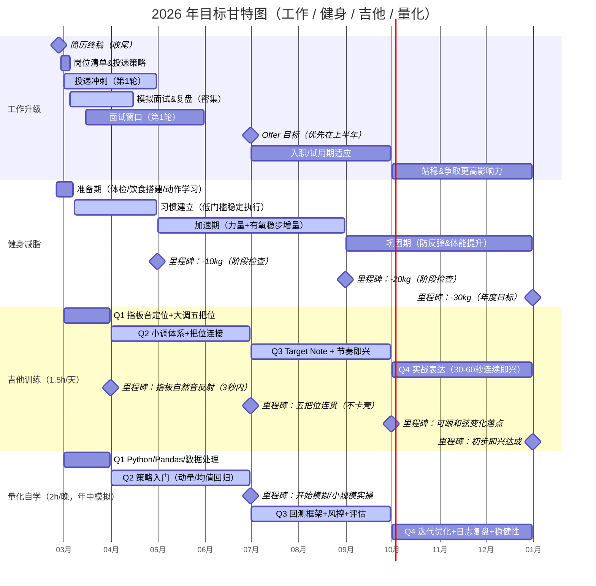
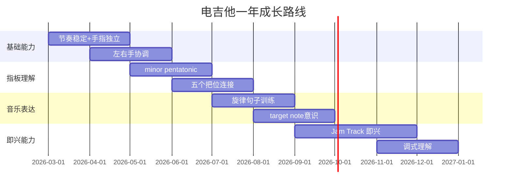

# 2026年提升计划(chatgpt)

---

## 工作升级

- 2.29 投递阳狮推广(猎头)-3.3日一面-寄

---

## 健身减脂

体重:110kg

身高:183cm

### 一、食谱(chatgpt+gemini)

| **时间**        | **食物**      | **重量 / 份量** | **减脂期优化备注**                                        |
| --------------- | ------------- | --------------- | --------------------------------------------------------- |
| **7:40 训练前** | 黑咖啡        | 1杯             | 提神，加速脂肪分解                                        |
|                 | 香蕉          | 半根            | 提供快速能量，防止低血糖                                  |
| **9:30 训练后** | 蛋白粉        | 1勺 (约30g)     | 快速吸收                                                  |
|                 | 鸡蛋          | 2个 (全蛋)      | 提供优质脂肪和蛋白质                                      |
|                 | 燕麦          | **50g (生重)**  | 非训练日可不吃                                            |
| **13:00 午餐**  | 鸡胸肉/瘦猪肉 | **200g**        |                                                           |
|                 | 米饭          | 150g (熟重)     | 干净碳水                                                  |
|                 | 蔬菜          | 200g+           | 多吃绿叶菜，增加饱腹感                                    |
|                 | 橄榄油        | 1勺 (约10g)     | 优质脂肪                                                  |
| **18:30 晚餐**  | 瘦牛肉        | 200g            | 优质蛋白，富含铁和锌                                      |
|                 | 红薯/紫薯     | 200g            | 红薯饱腹感极强，足够了                                    |
|                 | 蔬菜          | 200g+           | 尽量水煮或少油清炒                                        |
| **21:00 可选**  | 无糖希腊酸奶  | **100g-200g**   | **微调** ：如果不饿 **尽量不吃** ；饿的话吃纯无糖的垫肚子 |

### 二、训练清单(chatgpt)

| 时间         | **动作**     | **重量**  | **组数** | **次数** |
| ------------ | ------------ | --------- | -------- | -------- |
| 周一(上半身) | 杠铃卧推     | 50kg      | 4        | 6        |
|              | 哑铃上斜推   | 中等      | 3        | 10       |
|              | 高位下拉     | 适中      | 4        | 10       |
|              | 坐姿划船     | 适中      | 3        | 12       |
|              | 面拉         | 轻重量    | 3        | 15       |
| 周三(下半身) | 深蹲         | 70kg      | 4        | 6        |
|              | 罗马尼亚硬拉 | 60kg      | 3        | 8        |
|              | 腿举         | 适中      | 3        | 12       |
|              | 腿弯举       | 适中      | 3        | 12       |
|              | 小腿         | 自选      | 4        | 15       |
| 周五(全身)   | 硬拉         | 80kg      | 5-8      | 3        |
|              | 哑铃卧推     | 中等      | 3        | 8        |
|              | 杠铃划船     | 适中      | 3        | 8        |
|              | 农夫走       | 自选      | 3        | 30m      |
| 有氧         | 力量后坡度走 | 15–20分钟 |          |          |
|              | 周日低强度   | 45分钟    |          |          |

---

## 吉他训练

### 一、一年成长路径

目标: jam tracks

### 二、每日一小时练琴计划

```mermaid
gantt
    title 每日1小时练琴流程
    dateFormat  HH:mm
    axisFormat  %M
section 基础控制
节奏训练           :a1, 00:00, 10m
手指独立性训练     :a2, after a1, 10m
左手控制练习       :a3, after a2, 10m

section 音乐能力
旋律练习           :a4, after a3, 10m
Jam Track 即兴     :a5, after a4, 10m

section 巩固
自由练习/复盘      :a6, after a5, 10m`
```

#### 一、节奏训练（10分钟）

- 节拍器：70 BPM
- 只用 B 弦 5 品。

##### 四分音符

- B弦：
- 5 - 5 - 5 - 5
- 持续 4 小节。

##### 八分音符

- B弦：
- 5 5 5 5 5 5 5 5
- 持续 4 小节。

##### 停顿训练

- 5 - - -
- 每小节只弹第一拍。

---

#### 二、左手控制（10分钟）

- 节拍器：60 BPM

##### 1234练习

- 高E弦
- 5 6 7 8
  6 7 8 9
  7 8 9 10
- 再在 B 弦重复。

##### 蜘蛛练习

- 高E弦 5 (1指)
- B弦 7 (3指)
- G弦 6 (2指)
- D弦 8 (4指)
- 循环 4 次。
- 要求：
  - 每个音干净
  - 手指离弦不要太高

---

#### 三、右手控制（10分钟）

- 节拍器：70 BPM

##### 交替拨弦

- B弦5品：
- 下 上 下 上 下 上
- 持续 8 小节。

##### 弦切换练习

- B弦5 → 高E弦5 → B弦5 → 高E弦5
- 保持交替拨弦。
