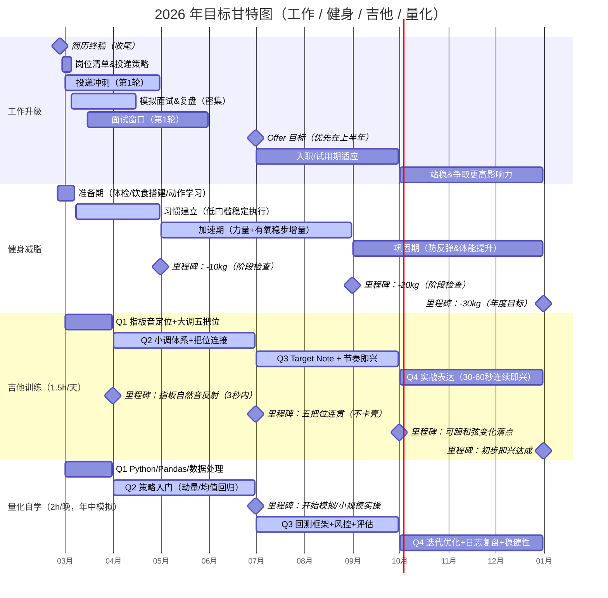

# 四大目标

## 健身减脂

### 每日饮食结构

| **项目** | **目标值** | **说明**          |
| -------- | ---------- | ----------------- |
| 总热量   | 3000 kcal  | 目标每周减0.7–1kg |
| 蛋白质   | 180g       | 保肌肉            |
| 脂肪     | 90g        | 维持激素水平      |
| 碳水     | 360g       | 保训练表现        |

### 训练日食谱

| **时间**    | **食物** | **重量** | **蛋白** | **碳水** | **脂肪** | **目的** |
| ----------- | -------- | -------- | -------- | -------- | -------- | -------- |
| 7:00 训练前 | 燕麦     | 60g      | 8g       | 40g      | 5g       | 供能     |
|             | 香蕉     | 1根      | 1g       | 25g      | 0g       | 快速碳水 |
|             | 鸡蛋     | 2个      | 12g      | 0g       | 10g      | 蛋白来源 |
| 9:30 训练后 | 蛋白粉   | 1勺      | 25g      | 3g       | 2g       | 恢复     |
|             | 米饭     | 150g熟   | 4g       | 45g      | 0g       | 补糖原   |
| 13:00 午餐  | 鸡胸肉   | 250g     | 58g      | 0g       | 4g       | 主蛋白   |
|             | 米饭     | 150g熟   | 4g       | 45g      | 0g       | 主碳水   |
|             | 西兰花   | 200g     | 6g       | 10g      | 0g       | 微量元素 |
|             | 橄榄油   | 1勺      | 0g       | 0g       | 14g      | 健康脂肪 |
| 18:30 晚餐  | 牛肉     | 200g     | 40g      | 0g       | 15g      | 蛋白     |
|             | 红薯     | 200g     | 3g       | 40g      | 0g       | 低GI碳水 |
|             | 蔬菜     | 200g     | 5g       | 10g      | 0g       | 维生素   |
| 21:00 可选  | 希腊酸奶 | 200g     | 18g      | 8g       | 5g       | 夜间恢复 |

### 非训练日食谱

| **时间** | **餐次** | **食物**   | **重量** | **蛋白(g)** | **碳水(g)** | **脂肪(g)** | **说明**      |
| -------- | -------- | ---------- | -------- | ----------- | ----------- | ----------- | ------------- |
| 08:00    | 早餐     | 鸡蛋       | 3个      | 18          | 0           | 15          | 提供脂肪+蛋白 |
|          |          | 燕麦       | 50g      | 6           | 30          | 3           | 低GI碳水      |
|          |          | 蓝莓       | 100g     | 1           | 12          | 0           | 微量元素      |
| 13:00    | 午餐     | 鸡胸肉     | 250g     | 58          | 0           | 4           | 主蛋白来源    |
|          |          | 米饭（熟） | 100g     | 3           | 30          | 0           | 控碳          |
|          |          | 西兰花     | 200g     | 6           | 10          | 0           | 高纤维        |
|          |          | 橄榄油     | 1勺      | 0           | 0           | 14          | 健康脂肪      |
| 18:30    | 晚餐     | 三文鱼     | 200g     | 40          | 0           | 20          | 优质脂肪      |
|          |          | 红薯       | 150g     | 2           | 30          | 0           | 稳定碳水      |
|          |          | 蔬菜       | 200g     | 5           | 10          | 0           | 增加饱腹      |
| 21:00    | 加餐     | 希腊酸奶   | 200g     | 18          | 8           | 5           | 夜间蛋白      |
|          |          | 坚果       | 20g      | 4           | 5           | 14          | 健康脂肪      |

### 训练清单

#### 周一(上半身)

| **动作**   | **重量** | **组数** | **次数** | **备注**   |
| ---------- | -------- | -------- | -------- | ---------- |
| 杠铃卧推   | 50kg     | 4        | 6        | 触胸慢下放 |
| 哑铃上斜推 | 中等     | 3        | 10       | 不痛为准   |
| 高位下拉   | 适中     | 4        | 10       | 控制节奏   |
| 坐姿划船   | 适中     | 3        | 12       | 背部收缩   |
| 面拉       | 轻重量   | 3        | 15       | 肩保护     |
| 平板支撑   | 自重     | 3        | 45秒     | 核心       |

#### 周三(下半身)

| **动作**     | **重量** | **组数** | **次数** | **备注** |
| ------------ | -------- | -------- | -------- | -------- |
| 深蹲         | 70kg     | 4        | 6        | 控制节奏 |
| 罗马尼亚硬拉 | 60kg     | 3        | 8        | 臀腿     |
| 腿举         | 适中     | 3        | 12       |          |
| 腿弯举       | 适中     | 3        | 12       |          |
| 小腿         | 自选     | 4        | 15       |          |

####  周五(全身)

| **动作** | **重量** | **组数** | **次数** | **备注** |
| -------- | -------- | -------- | -------- | -------- |
| 硬拉     | 80kg     | 5        | 3        | 不冲极限 |
| 哑铃卧推 | 中等     | 3        | 8        | 肩不痛   |
| 杠铃划船 | 适中     | 3        | 8        |          |
| 农夫走   | 自选     | 3        | 30m      | 核心     |

#### 有氧安排

| **类型**     | **时间**  | **强度**       |
| ------------ | --------- | -------------- |
| 力量后坡度走 | 15–20分钟 | 6km/h 坡度6–8% |
| 周日低强度   | 45分钟    | 稳定心率       |

