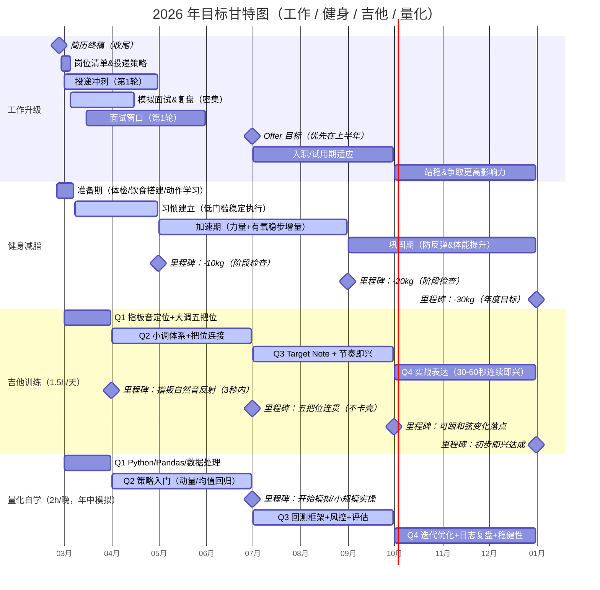

# 2026年提升计划

## 工作升级

- 2.29 投递阳狮推广(猎头)

## 健身减脂

### 一、食谱

| **时间**    | **食物**    | **重量** | 备注         |
| ----------- | ----------- | -------- | ------------ |
| 7:40 训练前 | 黑咖啡      |          |              |
|             | 半根香蕉    |          |              |
| 9:30 训练后 | 蛋白粉      | 1勺      |              |
|             | 鸡蛋        | 2个      |              |
|             | 米饭        | 150g熟   | 非训练日不吃 |
| 13:00 午餐  | 鸡胸肉      | 250g     |              |
|             | 米饭        | 150g熟   |              |
|             | 蔬菜        | 200g     |              |
|             | 橄榄油      | 1勺      |              |
| 18:30 晚餐  | 牛肉/三文鱼 | 200g     |              |
|             | 红薯        | 200g     |              |
|             | 蔬菜        | 200g     |              |
| 21:00 可选  | 希腊酸奶    | 200g     |              |

### 二、训练清单

| 时间         | **动作**     | **重量**  | **组数** | **次数** |
| ------------ | ------------ | --------- | -------- | -------- |
| 周一(上半身) | 杠铃卧推     | 50kg      | 4        | 6        |
|              | 哑铃上斜推   | 中等      | 3        | 10       |
|              | 高位下拉     | 适中      | 4        | 10       |
|              | 坐姿划船     | 适中      | 3        | 12       |
|              | 面拉         | 轻重量    | 3        | 15       |
| 周三(下半身) | 深蹲         | 70kg      | 4        | 6        |
|              | 罗马尼亚硬拉 | 60kg      | 3        | 8        |
|              | 腿举         | 适中      | 3        | 12       |
|              | 腿弯举       | 适中      | 3        | 12       |
|              | 小腿         | 自选      | 4        | 15       |
| 周五(全身)   | 硬拉         | 80kg      | 5        | 3        |
|              | 哑铃卧推     | 中等      | 3        | 8        |
|              | 杠铃划船     | 适中      | 3        | 8        |
|              | 农夫走       | 自选      | 3        | 30m      |
| 有氧         | 力量后坡度走 | 15–20分钟 |          |          |
|              | 周日低强度   | 45分钟    |          |          |

## 吉他训练

### 一、练琴定位（先站对位置）

你不是在“练技术”。你是在构建：

> 脑中音乐 → 指板路径 → FretFlow结构表达

只要从这个视角出发，就不会陷入枯燥执行。

---

### 二、前三个月阶段节奏

#### 第1阶段（第1–4周）

目标：

- 单弦旋律不慌
- 听到旋律能快速定位大概区域
- 建立个人旋律语言库存

禁止：

- 同时学习多套体系（CAGED / 调式大全）
- 纯音阶机械练习
- 复杂练琴表

每日时长：40–60分钟

---

### 三、每日结构

#### ① 音乐先发生（5分钟）

不碰琴。

- 放一首熟歌
- 脑中跟唱
- 停止播放
- 自己改一小句

问自己：

- 如果这是我的回应，我会怎么唱？
- 情绪加强一点，会往哪里走？

---

#### ② 单弦找旋律（15分钟）

- 只用2弦或3弦
- 慢
- 不扫弦
- 不跑音阶

目标：方向感，而不是准确度。

---

#### ③ 旋律变体（15分钟）

对同一句旋律做：

- 换节奏
- 加滑音
- 换把位

录音保存，不写谱。

---

#### ④ 技术补丁（10分钟）

只修刚才真实卡住的点：

- 推弦音准
- 滑音干净度
- 换把位衔接

技术从表达倒推。

---

### 四、每周结构

#### 周一：扒一句主旋律

只扒一句，不贪多。

---

#### 周三：三种指板表达

同一句旋律：

- 不同位置
- 不同弦
- 不同节奏

---

#### 周五：情绪实验

改成：

- 开心版
- 冷静版
- 激进版

---

#### 周日：5分钟自由即兴录音

回听一次。

找一句有感觉的加入语言库。

---

### 五、语言库结构

每周至少保留：

- 1段旋律
- 3种指板表达
- 1个情绪变化版本

只录音，不写谱。

---

### 六、三个月递进

第1个月：
单弦 + 旋律方向感

第2个月：
加入简单伴奏（和弦背景）

第3个月：
开始寻找 Target Note（落在和弦音）

---

### 七、第一天启动方式（琴到手）

不要练系统。

只做：

1. 熟悉琴颈
2. 随便弹
3. 找一句旋律

结束。

不要超过60分钟。

---

核心判断标准

每天只问一句：

> 今天，我有没有把脑中音乐变成指板路径？

有 = 满分。
