# 每日执行系统（现金流优先版）

核心原则：

- 🔴 找工作 = 现金流主线\
- 🟢 健身 = 身体系统\
- 🔵 吉他 = 表达系统\
- 🟡 仲裁 = 项目任务

---

# 每日 Timeline 甘特图

```mermaid
gantt
    title 每日时间结构
    dateFormat  HH:mm
    axisFormat %H:%M

    section 🟢 健身系统
    起床准备            :07:30, 30m
    健身                :08:00, 90m
    洗澡早餐缓冲        :09:30, 45m

    section 🔴 求职主线
    求职深度工作1       :10:15, 75m
    休息                :11:30, 15m
    求职深度工作2       :11:45, 45m

    section 午间恢复
    午餐休息            :12:30, 30m

    section 🟡 仲裁项目
    仲裁材料 / 文档整理 :13:00, 120m

    section 🔴 下午求职
    求职推进            :15:30, 120m

    section 晚间恢复
    放松缓冲            :17:30, 45m
    晚餐                :18:15, 45m

    section 🔵 吉他
    吉他练习            :19:00, 90m

    section 收尾
    放松 / 娱乐         :20:30, 45m
    轻阅读              :21:15, 45m
    睡眠准备            :22:00, 30m
```

---

# 极简每日执行看板（可直接打勾）

    日期：

---

## 🔴 找工作（现金流）

- [ ] 投递岗位 ≥ 5\
- [ ] 岗位 / 公司研究\
- [ ] 面试准备或模拟面试

---

## 🟢 健身

- [ ] 完成训练\
- [ ] 饮食控制

---

## 🔵 吉他

- [ ] 练琴 30--90 分钟

---

## 🟡 仲裁（如当天需要）

- [ ] 材料推进\
- [ ] 证据 / 文档整理

---

# 今日完成度

- [ ] 找工作\
- [ ] 健身\
- [ ] 吉他

完成 **2/3 即为合格的一天**

---

# 每日复盘（30秒）

    今天是否推进了现金流？

如果答案是 **是**，这一天就是成功的一天。

---

# 周末可选学习模块

    周末任选一天

    14:00 – 16:00

内容：

- 量化学习
- AI视频制作

规则：

- 不超过 2 小时
- 不影响求职主线
