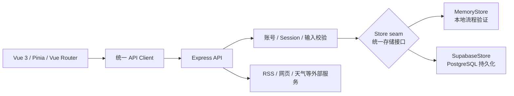
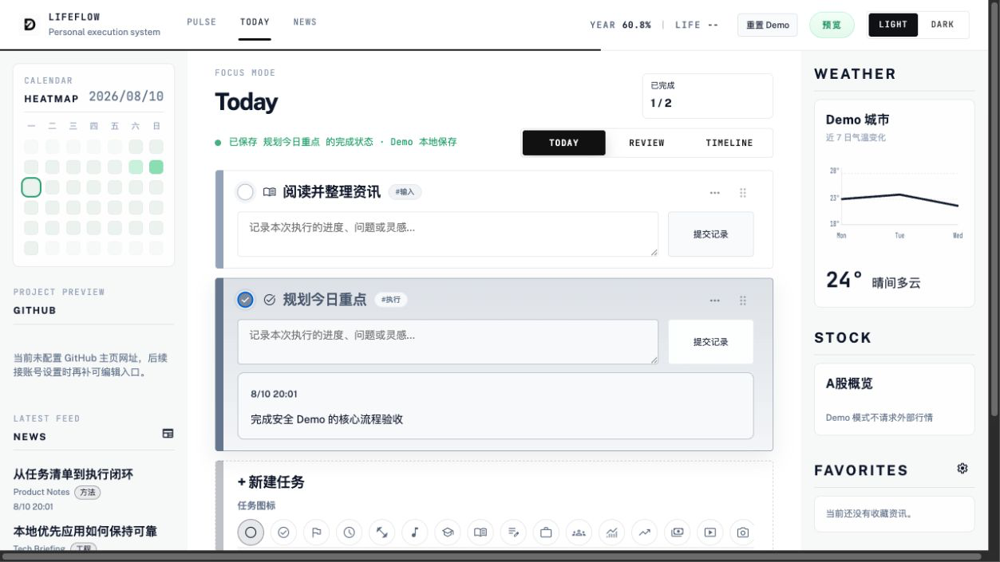
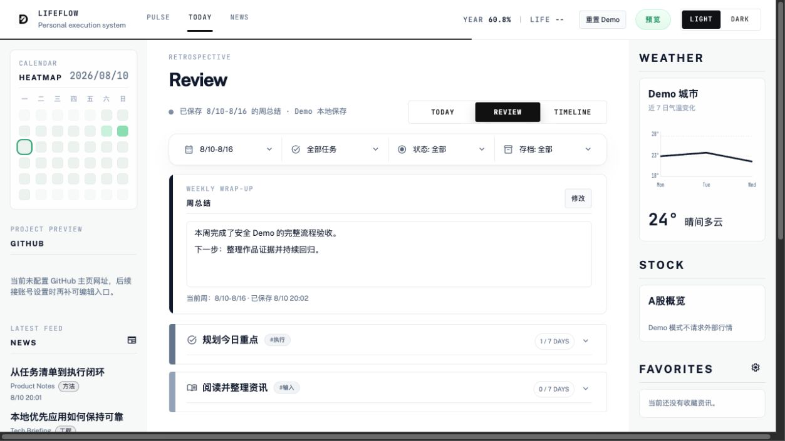
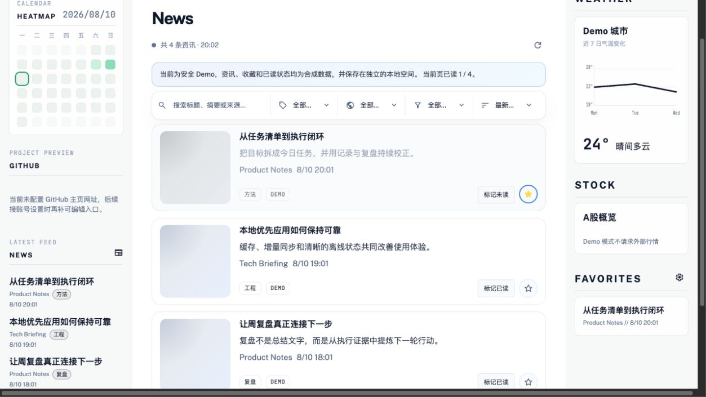
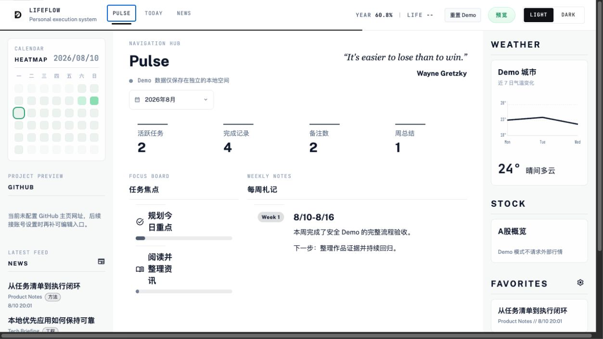

# LifeFlow

> 一个以个人长期真实使用场景驱动的业务数字化作品：我把分散的任务、执行记录、周复盘与信息输入整理成可运行、可测试、可解释的数据闭环，并用 AI Coding 辅助完成交付。

LifeFlow 面向需要持续安排工作、记录过程并定期复盘的个人知识工作者。它展示的不是传统“手写全栈项目”，而是从业务问题和流程规则出发，借助 AI Coding 协作完成产品原型、工程实现与验收的过程。

## 2 分钟了解项目

| 关注点 | 可直接验证的内容 |
| --- | --- |
| 业务问题 | 任务、过程备注、周总结和资讯分散，执行上下文难以连续沉淀，复盘需要重复整理。 |
| 目标用户与场景 | 需要每日执行、按周复盘并持续获取信息输入的个人知识工作者；来源于我本人的长期使用场景。 |
| 本人职责 | 定义业务问题、用户流程、业务规则与数据边界，做技术取舍并负责最终验收。AI 协助代码实现、测试草案、排错和方案整理。 |
| 最强证据 | 无后端即可操作的隔离 Demo；覆盖账号与跨用户隔离的后端测试；Demo 状态测试；可在 Memory / Supabase 之间切换的统一存储接口。 |
| 项目边界 | 这是作品与产品原型，没有企业生产落地、大规模用户、商业收益或真实 Supabase 端到端验证。 |

最快验证方式：

```bash
npm ci
npm run dev
```

打开 `http://localhost:5173/auth`，点击“体验安全 Demo”。该模式不需要 `.env`、账号或后端，也不会连接生产 API、Supabase、资讯、天气或行情服务。

## 业务问题与关键闭环

**现状**：任务安排、执行备注、周总结和资讯来源位于不同工具，数据彼此割裂；临近周末时，需要重新拼接“做了什么、留下了什么、下一步关注什么”。

**目标状态**：让每天的动作自然沉淀为复盘材料，并让复盘结果回到统一的状态视图和信息输入流程。

核心闭环是：

1. **Today：任务与记录**——创建、排序、完成任务，并按日期记录执行过程。
2. **Review / Timeline：周复盘**——聚合任务变化与每日记录，编辑并确认保存周总结。
3. **Pulse：状态聚合**——查看任务、记录和周总结形成的摘要。
4. **News：信息输入**——管理资讯源、刷新内容、标记已读或收藏，为后续行动提供输入。

## 本人职责与 AI Coding 边界

我负责：

- 从个人长期使用中识别问题，确定目标用户、信息架构和主流程。
- 定义任务排序、每日记录、周总结、资讯状态等业务规则。
- 确定 Demo 与真实账号的数据边界、会话方式、存储切换和部署取舍。
- 通过代码审查、自动化测试、生产构建和真实页面操作完成验收。

AI 用于生成或修改部分代码、补充测试草案、辅助排错和整理实现方案。需求判断、流程与规则、数据边界、技术取舍和最终验收均由我负责。项目要证明的是把业务问题推进到可验证交付的能力，而不是代码是否全部手写。

## 方案与关键链路

### 安全 Demo：低门槛验证业务流程

登录页 `/auth` 提供“体验安全 Demo”入口。Demo 使用固定生成的合成任务、执行记录、周总结、资讯和天气数据，可实际创建、编辑、排序和完成任务，提交备注、保存周总结、标记资讯状态并查看 Pulse 聚合。

- 不请求生产 API、Supabase、外部资讯、天气或行情服务。
- 所有修改只写入独立的浏览器 `localStorage`，不会读取或覆盖真实账号数据。
- 刷新后保留 Demo 进度；顶部“重置 Demo”恢复初始数据；退出 Demo 会清除这份独立数据。

### 真实模式：认证、业务 API 与可替换存储



真实账号的业务操作经 Express 写入 Memory 或 Supabase，而不是由浏览器直连数据库。统一存储接口（Store seam）让相同路由和业务规则可在易失内存与持久化存储之间切换：Memory 用于本地流程验证；Supabase 用于需要跨进程持久化和跨设备同步的部署。

### 数据隔离与安全边界

- 前端 API Client 携带 Session Cookie，并保留 `x-session-id` 兼容路径；后端在路由层完成认证和输入校验。
- Supabase 模式下，任务、每日记录、周总结、资讯源、内容和收藏均按当前会话的 `user_id` 限定读写范围。
- 跨域部署要求前后端均使用 HTTPS；后端按场景写入 `SameSite=None; Secure` Cookie，并用 `CORS_ORIGIN` 限制前端来源。
- `SUPABASE_SERVICE_ROLE_KEY` 只允许保存在后端。当前隔离主要依靠后端会话与带 `user_id` 的查询，数据库尚未配置独立 RLS，因此不能绕过后端暴露数据库权限。

后端接口、环境变量和数据库初始化细节见 [后端说明](backend/README.md)。

## 3 分钟安全 Demo

先执行前述 `npm ci` 与 `npm run dev`，再打开 `http://localhost:5173/auth`：

1. 点击“体验安全 Demo”进入 Today。**验证点：**页面显示 Demo 状态，浏览器不需要后端即可进入。
2. 完成一个任务并提交一条执行备注。**验证点：**任务状态和当天记录立即更新，刷新页面后仍保留。
3. 进入 Review，写入周总结；先点击保存，再在弹窗中二次点击“确认保存”。**验证点：**Review 切换到已保存 / 预览状态，并可在 Pulse 的月度聚合 / 每周札记中看到该周总结。
4. 打开 News，将一条资讯标记为已读并收藏。**验证点：**阅读与收藏状态同步变化，过程不请求外部资讯源。
5. 回到 Pulse。**验证点：**可看到任务、记录和周总结的聚合结果。
6. 点击顶部“重置 Demo”。**验证点：**刚才的修改被清除并恢复固定合成数据。

Demo 的目标是安全验证主业务闭环，不代表真实账号、Supabase 或外部服务已经完成生产环境验收。

## 安全 Demo 界面证据

以下截图来自同一次完整 Demo 流程，全部使用合成数据：Today 记录执行并完成任务，Review 保存周总结，News 标记已读与收藏，最后在 Pulse 查看聚合结果。

| Today：执行记录与任务状态 | Review：周总结保存结果 |
| --- | --- |
|  |  |

| News：合成资讯状态 | Pulse：任务、记录与周总结聚合 |
| --- | --- |
|  |  |

## 工程证据与验证

本次验证于 2026-08-10 在本地 Node.js v25.5.0、npm 11.8.0 环境完成：

| 证据 | 实际结果 |
| --- | --- |
| `npm test` | 3 / 3 通过：Demo 初始化与独立存储、任务 / 记录 / 周总结持久化、资讯标记和重置；其中独立存储测试证明不会覆盖真实用户缓存。 |
| `npm run backend:test` | 21 / 21 通过：密码与恢复码、账号 Session、跨账号任务隔离、Memory Store、内容刷新与去重、增量同步、天气降级、Supabase 常见配置错误分类。 |
| `npm run build` | Vite 生产构建成功；主 JavaScript 包为 522.05 kB（gzip 179.57 kB），保留超过 500 kB 的 chunk size warning。 |
| 桌面浏览器手动验收 | 无后端时从 `/auth` 进入安全 Demo，实际完成新建任务、提交备注、完成任务、刷新后确认持久化、Review 二次确认保存、News 已读 / 收藏、Pulse 聚合、重置与退出；全流程未观察到相关控制台 error / warn。 |
| 375px 移动端检查 | 实际内容宽度无横向溢出，Today 核心入口可见。 |

在仓库根目录运行：

```bash
# 后端 Node.js 测试
npm run backend:test

# Demo 状态单元测试
npm test

# 前端生产构建
npm run build
```

上述浏览器验收为手动操作，尚未形成可提交、可重复运行的浏览器自动化回归。真实 Supabase 连接不在当前自动化测试范围内；项目声明的 Node.js 20.x 也未在本次验证中精确复跑。

## 本地运行真实模式

要求 Node.js 20 和 npm。全新 clone 分别安装前端与后端依赖：

```bash
npm ci
npm --prefix backend ci
cp backend/.env.example backend/.env
```

`.env.example` 默认不包含 Supabase 凭据，因此后端使用 Memory 模式。分别启动两个进程：

```bash
# 终端 1：Express，默认 http://localhost:8787
npm run backend:dev

# 终端 2：Vite，默认 http://localhost:5173
npm run dev
```

打开 `http://localhost:5173`。Memory 模式支持完整账号与业务 API，但服务重启后数据会丢失，只适合本地开发和流程验证。

## 部署

- 前端可部署到 Vercel，项目 Root Directory 使用仓库根目录。
- 后端需部署到可持续运行 Node.js 的服务，并配置 `CORS_ORIGIN`。
- 持久化部署需配置 `SUPABASE_URL` 和 `SUPABASE_SERVICE_ROLE_KEY`；两项均未配置时自动使用易失的 Memory 模式。
- 前端部署时需要让 API Base 指向对应后端，且跨域前后端均使用 HTTPS。

## 已知限制

- 当前项目由个人长期使用场景驱动，没有可证明的公开用户规模、企业采用、商业收益或生产运行结果。
- Supabase 模式已有实现和存储错误测试，但当前作品集收口未连接真实 Supabase 项目完成端到端验证。
- 用户隔离主要由后端会话校验和带 `user_id` 的查询保证；数据库侧尚未配置独立 RLS 策略。
- 自定义 RSS / 网页信源由后端发起请求，尚未完成生产级内网地址拦截和完整 SSRF 防护。
- News、天气、每日语录等依赖外部服务，可能受超时、限流、源站结构变化或服务不可用影响。
- 本地快照用于离线回显和同步恢复，不等同于完整的 local-first 写入队列或长期备份。

## 仓库结构

```text
LifeFlow/
├─ src/                         # Vue 前端
├─ public/                      # PWA 与静态资源
├─ backend/                     # Express API、测试与 Supabase schema
├─ docs/                        # 历史规划和原型，不代表当前实现状态
├─ test/                        # Demo 状态单元测试
├─ package.json
├─ vite.config.js
└─ README.md                    # 作品入口与运行说明
```

历史规划和原型保留了设计过程，但部分内容早于当前 Vue 与 Pulse 实现；判断当前能力时以运行代码、测试和本 README 为准。
