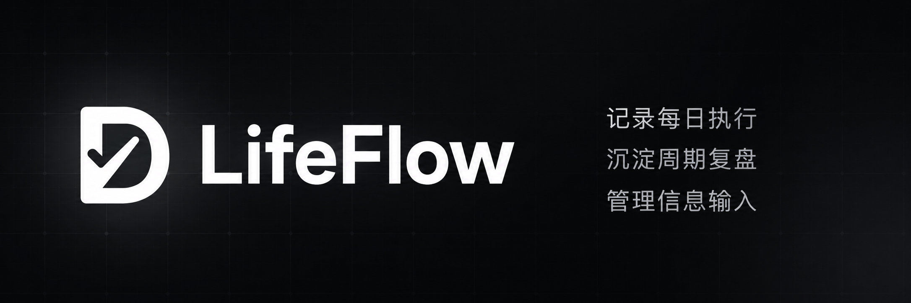
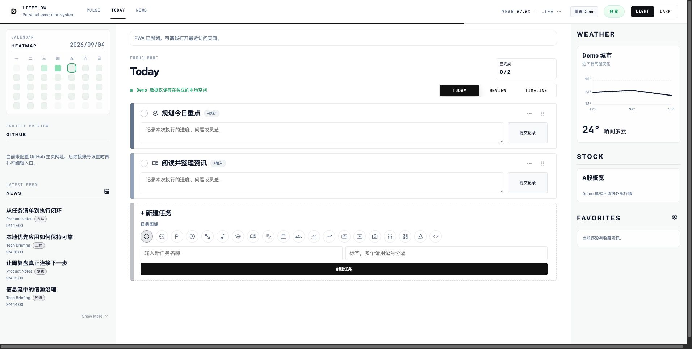

<div align="center">

# LifeFlow

**把每日执行、周期复盘和信息输入连接成一个可持续的个人工作闭环。**



</div>

## 项目概览

LifeFlow 是面向个人长期使用场景的记录与复盘工具。它把任务、执行备注、周总结和日常信源放在同一个工作流里，让当天发生的事实能够在之后被回看，而不是散落在互不关联的清单和阅读工具中。

项目提供可运行、可测试的 Vue + Express 应用，也提供不连接后端或外部服务的安全 Demo，方便直接体验核心流程。

## 核心功能

- **记录每日执行**：创建、排序和完成任务，并把执行过程关联到具体任务与日期。
- **沉淀周期复盘**：按时间范围查看任务变化、完成记录和执行备注，保存 Markdown 周总结。
- **管理信息输入**：维护资讯信源、阅读状态和收藏，让 News、首页与侧栏使用同一份状态。
- **保持状态连续**：远端暂时不可用时仍可查看最近一次成功同步的快照；未经确认的写入不会显示为已同步。
- **安装为 PWA**：支持独立窗口运行、更新提示与最近访问页面的离线打开。

### 产品界面



截图来自安全 Demo：界面使用固定合成数据，不包含真实账号、个人信息或外部服务数据。

## 快速体验

项目要求 Node.js 20.x。只体验安全 Demo 时无需启动后端：

```bash
npm ci
npm run dev
```

打开 `http://localhost:5175/auth`，点击 **体验 Demo**。所有操作只写入独立的浏览器 `localStorage`，不会连接生产 API、Supabase、资讯、天气或行情服务。

建议按下面的顺序体验：

1. 在 Today 完成一项任务并提交执行备注。
2. 切换到 Review，查看执行记录并保存周总结。
3. 打开 News，将一条合成资讯标记为已读或收藏。
4. 回到 Pulse，查看由任务、记录和周总结派生的状态摘要。
5. 点击顶部的“重置 Demo”恢复初始数据。

## 本地运行真实模式

全新 clone 后分别安装前后端依赖：

```bash
npm ci
npm --prefix backend ci
```

启动两个进程：

```bash
# 终端 1：Express API，默认 http://localhost:8787
npm run backend:dev

# 终端 2：Vite 前端，默认 http://localhost:5175
npm run dev
```

未配置 Supabase 凭据时，后端使用 Memory Store。它支持账号和核心业务流程，但服务重启后数据会丢失，适合本地开发与流程验证。启用 Supabase 前再复制 `backend/.env.example` 并填写对应配置。

## 工程验证

```bash
# 前端状态与 Demo 测试
npm test

# 后端账号、数据隔离、存储与信息输入测试
npm run backend:test

# 前端生产构建
npm run build
```

## 技术栈

- 前端：Vue 3、Pinia、Vue Router、Vite、vite-plugin-pwa
- 后端：Node.js、Express、Zod
- 数据：Memory Store；可选 Supabase Postgres

后端配置、接口和数据库基线见 [backend/README.md](backend/README.md)。

## 职责与 AI Coding 协作

我负责从真实使用场景识别问题，定义信息架构、业务规则、数据边界和部署取舍，并通过代码审查、测试、生产构建与页面操作完成验收。AI Coding 用于协助实现、测试草案、排错和方案整理；需求判断、业务规则和最终验收由我负责。

## 当前边界

- 这是个人作品与产品原型，不宣称公开用户规模、企业采用、商业收益或生产运行结果。
- Supabase Store 已实现并覆盖配置错误分类测试，但尚未连接真实 Supabase 项目完成端到端验收。
- 数据隔离由后端 Session 和带 `user_id` 的查询保证；数据库侧尚未配置独立 RLS，因此 `SUPABASE_SERVICE_ROLE_KEY` 必须只保存在后端。
- 自定义 RSS / 网页信源尚未完成生产级内网地址拦截与完整 SSRF 防护，公开部署前需要补齐该边界。

## 部署方向

前端可部署到 Vercel；后端需要持续运行的 Node.js 服务，并设置 `CORS_ORIGIN`。要启用持久化，再在后端配置 `SUPABASE_URL` 和 `SUPABASE_SERVICE_ROLE_KEY`。完整步骤见 [后端部署说明](backend/README.md#部署注意)。

## 开源许可证

本项目采用 [MIT License](LICENSE)。
