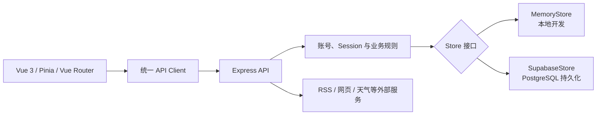

# LifeFlow

LifeFlow 是一个面向个人知识工作者的执行与信息管理工具：把任务安排、每日记录、周复盘和资讯阅读放进同一套可追踪流程。当前项目是个人长期使用场景驱动的作品与产品原型，不代表已经在企业生产环境或大规模用户中验证。

## 从分散记录到执行闭环

**As-Is**：任务、过程备注、周总结和资讯来源分散在不同工具里，执行记录难以连续沉淀，复盘也需要重复整理上下文。

**To-Be**：在 LifeFlow 中创建和排序今日任务，随执行写入记录，再从 Review / Timeline 回看进展并完成周总结；Pulse 汇总当前状态，News 聚合可配置资讯源，FretFlow 承载吉他练习。

核心闭环：

1. 在 Today 创建、排序和更新任务。
2. 按日期记录执行过程与备注。
3. 在 Review / Timeline 聚合任务变化，形成周总结。
4. 在 Pulse 查看摘要，在 News 获取下一步工作所需的信息输入。

## 已实现能力

- 账号注册、登录、退出、恢复码重置密码及 Session 管理
- Today 任务增删改查、拖拽排序、归档与每日记录
- Review / Timeline 周复盘、任务时间线与周总结
- Pulse 状态摘要、天气及可配置桌面组件
- News 资讯聚合、信源管理、手动刷新与收藏
- FretFlow 指板、音阶/和弦、CAGED、五度圈和节拍器训练
- 本地快照与服务端增量同步
- Memory / Supabase 两种后端存储模式

## 安全 Demo 与真实模式

登录页 `/auth` 提供“体验安全 Demo”入口，点击后进入 `/today`，用来验证主要流程而不接触真实账号和个人数据：

- 使用固定生成的任务、执行记录、周总结、资讯和天气等合成数据。
- 可实际创建、编辑、排序和完成任务，记录备注、保存周总结，标记资讯已读或收藏，并在 Pulse 查看月度聚合。
- 不请求生产 API、数据库或外部资讯服务；所有修改只写入独立的浏览器本地存储。
- 刷新页面后 Demo 进度仍会保留；顶部“重置 Demo”恢复初始数据，退出 Demo 会清除这份独立数据。

真实模式需要注册或登录账号，业务操作通过 Express API 写入 Memory 或 Supabase。Memory 适合本地流程验证；需要跨进程持久化和跨设备同步时使用 Supabase。

## 3 分钟安全 Demo

安全 Demo 不需要启动后端、配置 `.env`、注册账号或提供任何外部服务凭据。安装前端依赖后即可运行：

```bash
npm ci
npm run dev
```

打开 `http://localhost:5173/auth`，按以下顺序演示主流程：

1. 点击“体验安全 Demo”，进入 Today。
2. 完成一个任务并提交一条执行备注。
3. 切换到 Review，写入周总结，确认保存。
4. 打开 News，标记一条资讯已读并收藏。
5. 回到 Pulse，查看任务、记录与周总结的聚合结果。
6. 点击顶部“重置 Demo”，恢复固定合成数据。

Demo 期间不会请求 API、Supabase、资讯源、天气或行情服务；页面会明确显示“Demo 模式不请求外部服务”等状态。所有操作仅保存到独立的浏览器本地存储，不会读取或覆盖真实账号数据。

## 系统如何工作



- 前端位于 `src/`，按 view、component、store、service 分层。
- 前端通过统一 API Client 调用 Express，并携带 Session Cookie；同时保留 `x-session-id` 兼容路径。
- 后端在路由层完成认证和输入校验，再通过同一存储接口访问 Memory 或 Supabase。
- Supabase 模式下，任务、每日记录、周总结、资讯源和收藏均带 `user_id`，后端按当前会话限定读写范围。
- 跨域部署时，前后端必须使用 HTTPS；后端按请求场景写入 `SameSite=None; Secure` Cookie，并通过 `CORS_ORIGIN` 限制允许的前端来源。

后端接口、环境变量和数据库初始化细节见 [后端说明](backend/README.md)。

## AI Coding 协作边界

这个项目采用“人定义问题与验收标准，AI 协助实现”的工作方式：

- 我负责真实使用问题、信息架构、业务规则、数据边界、技术取舍和最终验收。
- AI 用于生成或修改部分代码、补充测试草案、辅助排错和整理实现方案。
- 每次改动仍以代码审查、自动化测试、构建和真实页面操作作为验收依据。

因此，这个项目展示的重点不是单纯的代码产量，而是能否把需求、规则、实现、异常处理和验证串成一个可解释的工程闭环。

## 本地运行

要求 Node.js 20 和 npm。全新 clone 需要分别安装前端与后端依赖：

```bash
npm ci
npm --prefix backend ci
cp backend/.env.example backend/.env
```

`.env.example` 默认不包含 Supabase 凭据，因此后端会使用 Memory 模式。分别启动两个进程：

```bash
# 终端 1：Express，默认 http://localhost:8787
npm run backend:dev

# 终端 2：Vite，默认 http://localhost:5173
npm run dev
```

打开 `http://localhost:5173`。Memory 模式支持完整账号与业务 API，但服务重启后数据会丢失，只适合本地开发和流程验证。

## 验证

```bash
# 后端 Node.js 测试
npm run backend:test

# Demo 状态单元测试
npm test

# 前端生产构建
npm run build
```

前端自动化测试当前聚焦 Demo 数据的初始化、独立存储、任务/记录/周总结写入、资讯标记和重置；其余前端回归依赖生产构建以及对登录、Today、Review / Timeline、News 和 FretFlow 关键流程的实际页面检查。

后端测试覆盖密码与恢复码、账号 Session、跨账号任务隔离、Memory Store、内容刷新与去重、增量同步、天气降级，以及 Supabase 常见配置错误的分类。真实 Supabase 连接不在自动化测试范围内。

## 部署

- 前端可部署到 Vercel，项目 Root Directory 使用仓库根目录。
- 后端需部署到可持续运行 Node.js 的服务，并配置 `CORS_ORIGIN`。
- 持久化部署需配置 `SUPABASE_URL` 和 `SUPABASE_SERVICE_ROLE_KEY`；两项均未配置时会自动使用易失的 Memory 模式。
- 前端部署时需要让 API Base 指向对应后端，且跨域前后端都使用 HTTPS。

## 已知限制

- Supabase 模式已有实现和针对存储错误的自动化测试，但当前作品集收口未使用真实 Supabase 项目完成端到端验证。
- 用户数据隔离目前主要由后端会话校验和带 `user_id` 的查询保证，数据库侧尚未配置独立的 RLS 策略；不能绕过后端向客户端暴露 `service_role` key。
- 自定义 RSS / 网页信源会由后端发起请求，目前尚未完成面向生产环境的内网地址拦截与完整 SSRF 防护。
- News、天气、每日语录等能力依赖外部服务，可能受到超时、限流、源站结构变化或服务不可用影响。
- 本地快照用于离线回显和同步恢复，不等同于完整的 local-first 写入队列或长期备份。
- 项目目前没有可证明的公开用户规模、商业收益或企业生产运行数据。

## 仓库结构

```text
LifeFlow/
├─ src/                         # Vue 前端
├─ public/                      # PWA 与静态资源
├─ backend/                     # Express API、测试与 Supabase schema
├─ docs/                        # 历史规划和原型，不代表当前实现状态
├─ test/                        # Demo 状态单元测试
├─ package.json
├─ vite.config.js
└─ README.md                    # 作品入口与运行说明
```

历史规划和原型保留了设计过程，但部分内容早于当前 Vue、Pulse 和 FretFlow 实现；判断当前能力时以运行代码、测试和本 README 为准。
